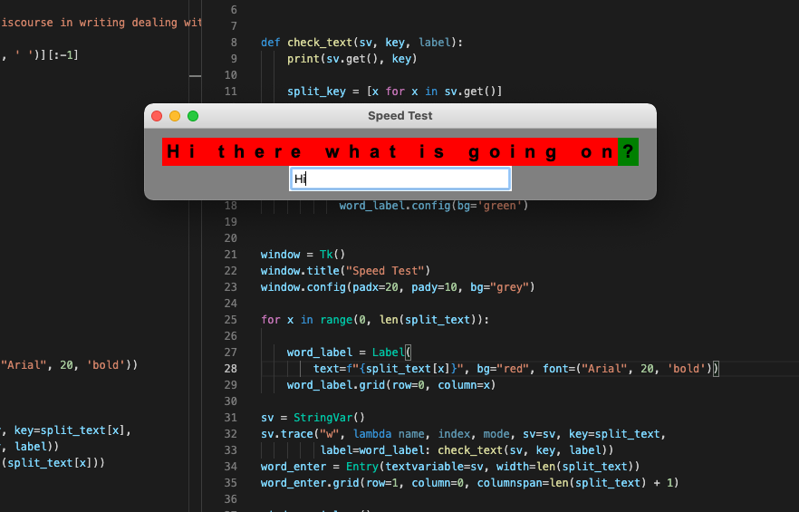

# Speed Typing Test

### Early On

I wanted to a make it interactive, where a text prompt would show up, with red background as a `tk.Label` widget, and as the user continued typing, it would check if the indexes lined up with what was asked of the text. If it is correct, the background of the Label widget would turn green.

I think to acheive this, I may need to create my own label class.